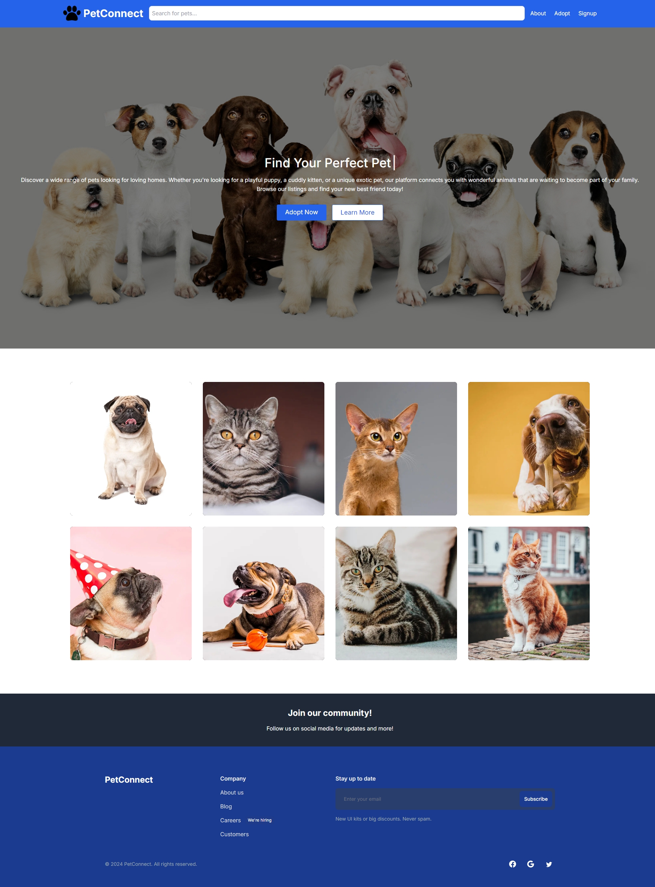
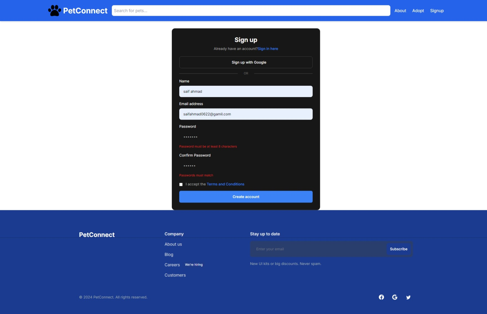
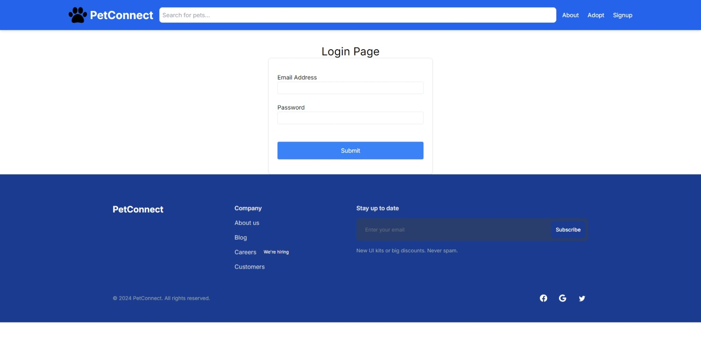
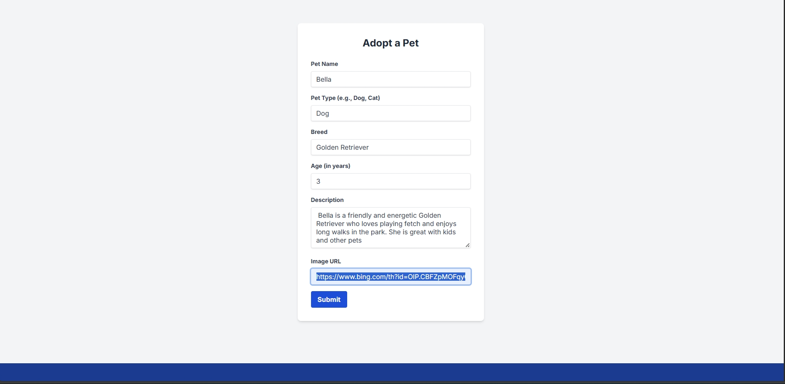
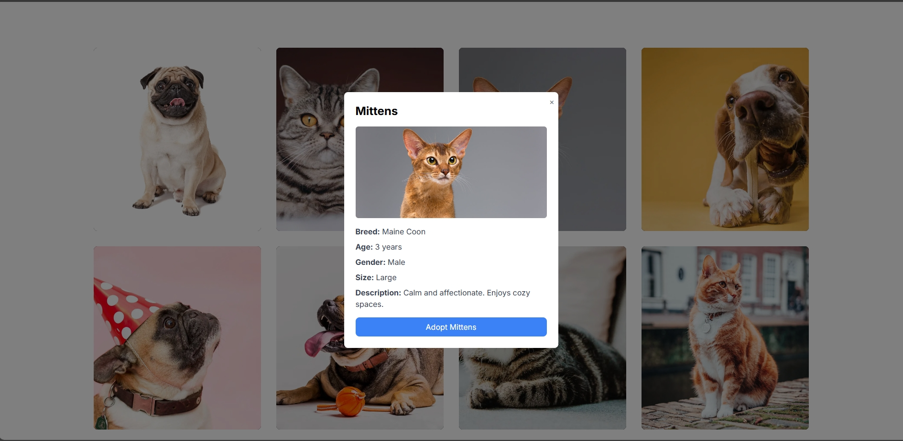
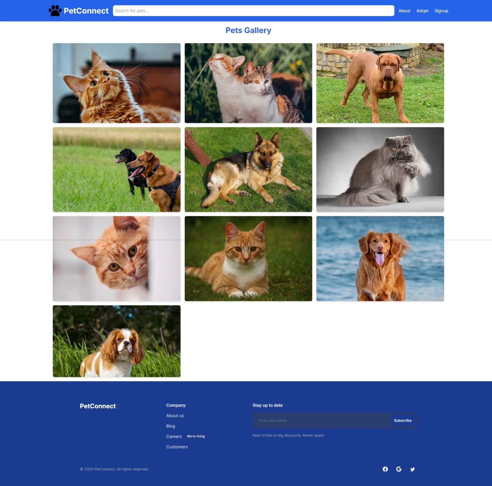
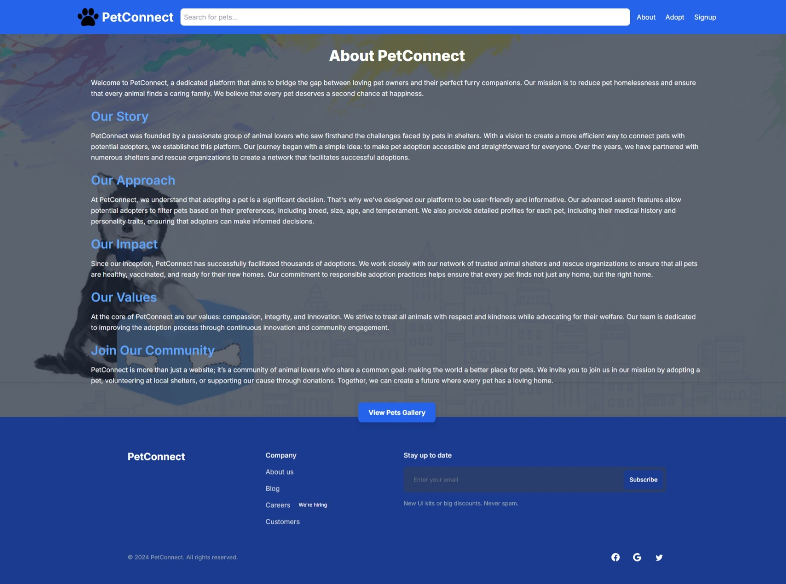

# PetConnect

A platform to facilitate pet adoption and connect pet owners with potential adopters.

PetConnect is a pet adoption platform built using Next.js, Tailwind CSS, Node.js, Express.js, and MongoDB. It provides a seamless experience for users to adopt pets, browse through a gallery, and manage their accounts.

## Table of Contents

- [Features](#features)
- [Technologies Used](#technologies-used)
- [Installation](#installation)
- [Usage](#usage)
- [Screenshots](#screenshots)
- [Deployment](#deployment)


## Features

- **User Authentication**: Sign up and log in using JWT authentication.
- **Pet Adoption Page**: Users can view available pets for adoption.
- **Pets Gallery**: A visually appealing gallery showcasing all pets.
- **Notifications**: Integrated React Toastify for user notifications.
- **Responsive Design**: Built with Tailwind CSS for a mobile-friendly layout.

## Technologies Used

- **Frontend**: Next.js, Tailwind CSS
- **Backend**: Node.js, Express.js
- **Database**: MongoDB
- **Deployment**: Vercel
- **Additional Libraries**:
  - **Tailwind CSS**: For utility-first styling.
  - **React Tabler Icons**: For intuitive iconography.
  - **Swiper JS**: For creating responsive sliders and carousels in the Pets Gallery.
  - **Headless UI & Chakra UI**: For accessible and customizable UI components.
  - **Material UI**: For implementing Material Design components where applicable.

## Installation

To run PetConnect locally, follow these steps:

1. Clone the repository:
   ```bash
   git clone https://github.com/yourusername/PetConnect.git
   cd PetConnect
Install dependencies for both client and server:
cd client
npm install
cd ../server
npm install


Set up environment variables:
Create a .env file in the server directory and add your MongoDB connection string.
  Start the server:
    npm start

Once the application is running, navigate to http://localhost:3000 in your browser to access PetConnect.

## Screenshots

### Home Page

*The Home Page of PetConnect welcomes users with a clean and modern design. It features a navigation bar at the top for easy access to different sections, including Pet Adoption, Pets Gallery, and About Us. The main section highlights featured pets available for adoption, encouraging users to explore further.*

### Sign Up Page

*The Sign Up Page enables new users to create an account easily. It requires basic information such as name, email, password, and confirmation of the password. A 'Sign Up' button is prominently displayed to encourage user registration.*

### Login Page

*The Login Page allows users to securely access their accounts. It includes fields for email and password, along with a 'Login' button. Users can also find a link to the Sign-Up page if they do not have an account yet, ensuring a smooth onboarding process.*

### Pet Adoption Page

*The Pet Adoption Page showcases pets available for adoption in a user-friendly layout. Each pet card includes an image, name, breed, age, and a brief description, making it easy for potential adopters to find their ideal pet companion.*

### Pet Availability

*This screenshot highlights the availability status of pets in the adoption process. Users can see which pets are currently available or have been adopted, helping them make informed decisions about their adoption journey.*

### Pets Gallery

*The Pets Gallery presents a visually appealing collection of all pets in the system. Users can browse through images of various pets, each linked to its respective adoption page for more details.*

### About PetConnect

*The About page provides information about PetConnect's mission and values. It explains the purpose of the platform in promoting pet adoption and connecting potential adopters with pets in need of homes.*


Screenshots demonstrating key features of the application.
## Deployment
PetConnect is deployed on Vercel. You can access it live at PetConnect Live Demo.
